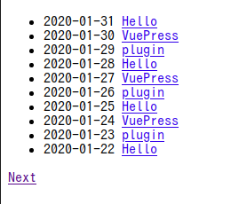
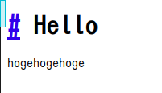

# VuePress と vuepress-plugin-blog でブログを作る

このブログは[VuePress](https://github.com/vuejs/vuepress)と[vuepress-plugin-blog](https://github.com/vuepressjs/vuepress-plugin-blog)で作られています。VuePress でも十分静的サイトを作成することが出来るのですが、vuepress-plugin-blog はブログに必要なタグやページャの機能など、ブログに必要なを追加してくれるのでとても便利です。

この記事では VuePress と vuepress-plugin-blog を使って最低限度機能するブログを作っていきたいと思います。

使用する VuePress と vuepress-plugin-blog のバージョンは次のようになります。

|         name          | version |
| :-------------------: | :-----: |
|       VuePress        |  1.2.0  |
| @vuepress/plugin-blog |  1.9.2  |

サンプルコードは[こちら](https://github.com/nasum/sample-vuepress-blog)になります。

## インストール

まずは必要なパッケージをインストールします。

```bash
$ yarn add -D vuepress @vuepress/plugin-blog
✨  Done in 14.83s.
```

最低限の機能であればこれだけで問題ありません。

## ディレクトリの作成

次のようにディレクトリを作成します。

```plane
├── docs
│   ├── .vuepress
│   │   ├── config.js
│   │   └── theme
│   │       └── layouts
│   └── _posts
│       └── test.md
├── package.json
└── yarn.lock
```

`docs` ディレクトリを作成し、その中に `.vuepress` と `_post` ディレクトリを作成します。

`.vuepress` ディレクトリ内には後述する設定を記述していく `config.js` の作成と、レイアウトのコンポーネントを入れる為の `theme` ディレクトリと `layouts` ディレクトリの作成を行います。

`_post` ディレクトリには記事ファイルである `test.md` を適当な markdown ファイルを作成しておきます。

## Layout コンポーネントの作成

`@vuepress/plugin-blog` は VuePress で使用するコンポーネントにブログの機能に必要なプロパティを与えてくれるプラグインです。なので、インストールするだけでブログが作れるわけではありません。プラグインを入れたことによって使用できるプロパティを使用し各コンポーネントを作成し、ブログを作っていきます。

コンポーネントは `docs/.vuepress/theme/layouts` に作成してきます。

```html
<!-- Layout.vue -->
<template>
  <div>
    <ul>
      <li v-for="page in $pagination.pages" :key="page.key">
        <time :datetime="page.frontmatter.date"
          >{{ page.frontmatter.date }}</time
        >
        <router-link :to="page.path">{{ page.title }}</router-link>
      </li>
    </ul>
    <div>
      <router-link v-if="$pagination.hasPrev" :to="$pagination.prevLink"
        >Prev</router-link
      >
      <router-link v-if="$pagination.hasNext" :to="$pagination.nextLink"
        >Next</router-link
      >
    </div>
  </div>
</template>
```

```html
<!-- Post.vue -->
<template>
  <content />
</template>
```

インデックスページを構成する `Layout.vue` と 記事ページを構成する `Post.vue` を作成しています。

Vue のコンポーネントにはプラグインにより `$pagination` というプロパティが追加されています。その中には記事のデータやページネーションの情報が入っており、コンポーネント内でそれを使用することでブログを構築することができます。

最低限の機能であれば上の 2 つのコンポーネントがあれば機能します。

`$pagination` からアクセスできるプロパティで今回使用しているのは次のとおりです。

| プロパティ名 | 解説                           |
| :----------- | :----------------------------- |
| pages        | ページのオブジェクトの配列     |
| hasPrev      | 前のページが存在するかの真偽値 |
| hasNext      | 次のページが存在するかの真偽値 |
| prevLink     | 前のページのリンク             |
| nextLink     | 次のページのリンク             |

ページのオブジェクトからアクセスできるプロパティで今回使用しているのは次のとおりです。

| プロパティ名 | 解説                         |
| :----------- | :--------------------------- |
| key          | ページオブジェクトのキー     |
| frontmatter  | 気にに設定された frontmatter |
| path         | ページのパス                 |
| title        | ページのタイトル             |

## config.js での設定

`.vuepress` ディレクトリ内の `config.js` に設定を書いていきます。設定は次のように書きます。

```javascript
module.exports = {
  title: "Sample VuePress Blog",
  plugins: [
    [
      "@vuepress/blog",
      {
        directories: [
          {
            id: "Index",
            dirname: "_posts",
            path: "/"
          }
        ]
      }
    ]
  ]
};
```

`directories` プロパティ内には記事のソースに関する設定を書いていきます。今回は次のプロパティを設定しています。

| プロパティ名 | 解説                                                                 |
| :----------- | :------------------------------------------------------------------- |
| id           | 識別子としてユニークな値を設定します。今回は `Index` を指定します。  |
| dirname      | 記事が入るディレクトリ名を設定します。今回は `_posts` を指定します。 |
| path         | インデックスページのパスを設定します 今回は `/` を指定します。       |

以上で設定は完了です。

## 記事の作成

記事を作成していきます。記事は `docs/_posts` に `.md` 形式で記述していきます。

```md
---
date: "2020-01-31"
auther: sample
lang: ja
---

# Hello

hogehogehoge
```

最上部の `---` で囲まれている領域が frontmatter になります。ここに記事固有の変数を記述していきます。ここで設定した記述は `$pagenation.pages` からアクセスできるページオブジェクトの `frontmatters` プロパティから参照できます。

## 出来上がったブログ

必要なファイルを作成したら次のコマンドを実行し動かします。

```bash
$ npx vuepress dev docs
success [20:32:05] Build 0e204f finished in 191 ms! ( http://localhost:8080/ )
```

出来上がったブログは次のように表示されます。

インデックスページ



記事ページ



レイアウトを新しく作ったためスタイルも当たっていない簡素なページですが、記事一覧やページネーションなどブログに必要な機能を簡単に作ることができました。

先程のコマンドではローカルのサーバーから配信していましたが、実際はHTMLをビルドコマンドで生成し、成果物をデプロイすることによってブログを公開することになると思います。ビルドのコマンドは次になります。

```bash
$ npx vuepress build
wait Rendering static HTML...
success Generated static files in .vuepress/dist.
```

## まとめ

VuePressと@vuepress/plugin-blogによるブログ作成を行いました。プラグインを用いたブログ作成はスタイルを自分で作ったりデプロイを自分で工夫しないといけないなど割と大変なことが多いのです。ですがブログの記事をmarkdownで書けたり、静的ファイルなのでブログシステムを使用するよりレスポンスが早いなどメリットも多いです。

@vuepress/plugin-blogはかなり機能が豊富で、ここで紹介できなかった記事をまとめる機能やsitemapの機能、RSS配信などが可能です。紹介しきれなかった機能は改めて記事にできればと思います。
