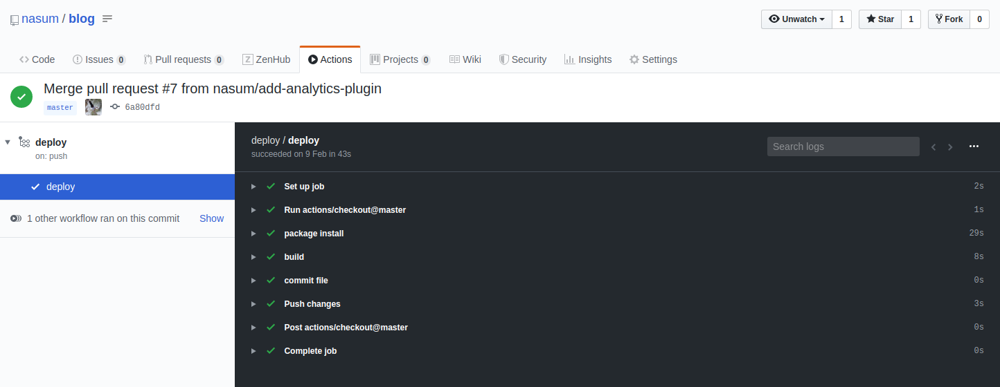

# VuePressで作ったブログをGitHubActionsでGitHub Pagesにデプロイする

[LAPRAS アウトプットリレー](https://daily.lapras.blog/)の2日目の記事です。

このブログはGitHubActionsでGitHub Pagesにデプロイしています。今回はそのことについて書いていきます。

## デプロイの構成

このブログはPublicなリポジトリの[nasum/blog](https://github.com/nasum/blog)とprivateなリポジトリのnasum/nasum.github.ioで構築されています。Publicなリポジトリの[nasum/blog](https://github.com/nasum/blog)のGitHubActionsのワークフローでからnasum/nasum.github.ioへの `git push` でデプロイを行っています。

普通は一つのリポジトリでやると思うのですが、LAPRASのアウトプットでHTMLのコード量だけ異常に増えたら嫌だなと思ってこうしています。

簡単に次のようなフローでデプロイを行っています。

1. Publicなリポジトリでmasterにマージされる
2. それを検知してビルドする（GitHubActionsで実行
3. ビルドした成果物をPrivateなリポジトリに`git push`する（GitHubActionsで実行

## GitHubActionsの設定

GitHubActionsの設定を見ていきます。次のような設定でデプロイフローを構築しています。

```yaml
name: deploy
on:
  push:
    branches:
      - master
jobs:
  deploy:
    runs-on: ubuntu-18.04
    env:
      GA: ${{ secrets.GA }}
    steps:
      - uses: actions/checkout@master
      - name: package install
        run: |
          yarn install
      - name: build
        run: |
          yarn run build
      - name: commit file
        run: |
          cd docs/.vuepress/dist
          echo ${{ secrets.DOMAIN }} > CNAME
          git config --global user.email ${{ secrets.EMAIL }}
          git config --global user.name ${{ secrets.NAME }}
          git init
          git add -A
          git commit -m 'deploy'
      - name: Push
        uses: ad-m/github-push-action@master
        with:
          github_token: ${{ secrets.ACCESS_TOKEN}}
          force: true
          directory: ./docs/.vuepress/dist
          repository: ${{ secrets.REPO_NAME }}
```

ポイントごとに見ていきます。

### masterへのpushを検知

masterへのpushの検知は次のように書きます。

```yaml
on:
  push:
    branches:
      - master
```

`on` ではワークフローをトリガするGitHubのイベントを指定できます。今回の場合だと`master` ブランチへの `push` を検知しワークフローを実行しています。

イベントは `push` だけでなく `pull_request` や定期的に実行する `schedule` もあったりします。詳しくは[ドキュメント](https://help.github.com/ja/actions/reference/workflow-syntax-for-github-actions)を見るとよいです。

### デプロイのワークフロー

デプロイのワークフローは `jobs` に書いていきます。

`runs-on` でビルド環境の設定をします。 `ubuntu` を設定していますが、`windows-latest` や `macos-latest` を指定できます。指定できる環境も[ドキュメント](https://help.github.com/ja/actions/reference/virtual-environments-for-github-hosted-runners)に詳しく書かれています。

`env` ではビルド環境での環境変数を設定しています。自分のブログはGAでアクセス解析をしているのでビルド時に埋め込むためにGAのIDを埋め込んでいます。

ここで `secrets.GA` と書いているのですが、これはGitHubのリポジトリのSettingsにあるSecretsから値を呼び出すコードです。PublicなリポジトリのSecretsはCollaboratorの権限を持つひとしかアクセスできないのでPublicなリポジトリで使っても大丈夫です（大丈夫なはず。見えちゃってたらこっそり教えてくれると嬉しい）。

そのあとの `steps` で具体的なデプロイプロセスを記述していきます。このあたりはCircleCIなどと同じような感じで書くことができます。

### デプロイステップ

GitHubActionsならではの機能として `uses` で他のActionを呼び出せるというのがあります。今回はmasterからチェックアウトしてくれる `actions/checkout` と、GitHubのリポジトリへpushしてくれる[`ad-m/github-push-action`](https://github.com/ad-m/github-push-action) の２つを使用しています。

具体的なデプロイステップは

1. `actions/checkout` でプロジェクトのチェックアウト
2. パッケージのインストール
3. ビルド
4. 成果物のディレクトリに移動し `git init` `add` `commit` してデプロイの準備を整える
5. `ad-m/github-push-action` で別のリポジトリにpush

の順番に行います。このプロセスはVuePressのドキュメントにあった[デプロイ方法](https://vuepress.vuejs.org/guide/deploy.html#github-pages)をそのままGitHubActionsに落とし込んだものです。

`ad-m/github-push-action` では `with` を使ってデプロイに必要な変数を埋め込んできます。ここではトークンや `force push` するかどうか、成果物のディレクトリなどを設定しています。

こうして設定したデプロイフローがうまく動くのGitHubで次のように実行され無事blogの更新がなされます。



## まとめ

VuePressで作ったブログをGitHubActionsでデプロイについて書いていきました。VuePress公式のデプロイ方法をそのままGitHubActionsに落とし込むことで簡単にデプロイができるようになりました。

GitHubActionsはまだ結構やれそうなことがたくさんあるので、例えばデプロイしたらTwitterで通知みたいなこともできそうなので今度はそれにチャレンジしたいと思います。
