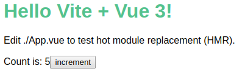
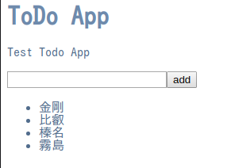
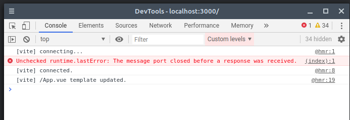

# バンドラ不要でSFCを配信できるVue専用dev server「vite」を試してみる

最近Vueの開発と勉強に便利そうな[vite](https://github.com/vuejs/vite)というものを知りました。なんでもSingle File Componentでも、バンドルする必要なくコードを配信できるdev serverのようです。

VueはVueCLIもあるのでさくっと開発環境作って実験とかできるのですが、バンドルする必要があってワンテンポ遅いのと、最小限の実装で作りたいときにいろいろ外さないといけないので面倒でした。`vite` を使うとさくっと実験できる環境が手に入るのでいい感じです。

Evan氏が一晩で作ったらしいです。すごい。

<blockquote class="twitter-tweet"><p lang="en" dir="ltr">As I was going to bed, I had an idea about a no-bundler dev setup (using native browser ES imports), but with support for Vue SFCs **with hot reload**. Now it&#39;s almost 6AM and I have PoC working. The hot reload is so fast it&#39;s near instant.</p>&mdash; Evan You (@youyuxi) <a href="https://twitter.com/youyuxi/status/1252173663199277058?ref_src=twsrc%5Etfw">April 20, 2020</a></blockquote> <script async src="https://platform.twitter.com/widgets.js" charset="utf-8"></script>

今回はとりあえず `vite` を試してみるのと、ついでにちゃんと勉強できていなかったcomposition apiを試していきたいと思います。

## viteでアプリケーションの作成

viteでのアプリケーション作成はコマンドで作成します。

```bash
$ yarn create vite-app app-name
```

実行すると `package.json` と `index.html` と `app.vue` が作成されます。

`index.html` は次のようになファイルが生成されます。

```html
<div id="app"></div>
<script type="module">
import { createApp } from 'vue'
import App from './App.vue'

createApp(App).mount('#app')
</script>
```

`script` タグのtype属性にmoduleが設定されています。これが可能なのはIEやAndroidのwebview以外のブラウザのようです [^1] 。開発用だから特に問題はないですね。

[^1]: [MDN web docs JavaScript モジュール](https://developer.mozilla.org/ja/docs/Web/JavaScript/Guide/Modules)

`app.vue` は次のように作成されます。

```vue
<template>
  <h1>Hello Vite + Vue 3!</h1>
  <p>Edit ./App.vue to test hot module replacement (HMR).</p>
  <p>
    <span>Count is: {{ count }}</span>
    <button @click="count++">increment</button>
  </p>
</template>

<script>
export default {
  data: () => ({ count: 0 })
};
</script>

<style scoped>
h1 {
  color: #4fc08d;
}

h1,
p {
  font-family: Arial, Helvetica, sans-serif;
}
</style>
```

普通にSingle File Componentです。data属性のcountをインクリメントできるコードです。次のコマンドを実行すると `localhost:3000` でdev serverが公開されます。

```bash
$ yarn run dev
yarn run v1.22.4
warning package.json: No license field
$ vite
vite v0.5.3
Dev server running at:
  > http://localhost:3000
  > http://192.168.1.88:3000
```

`localhost:3000` にブラウザでアクセスすると次のように表示されます。



incrementのボタンを押すとちゃんと数字が更新されます。この状態で `app.vue` を更新するとHMRで速反映されて開発体験が良いです。

## Vueのcomposition apiを使ってコードを書いてみる

### TODOリストの作成

サンプルが動いたのは確認できたのでちゃんと `vite` がアプリケーション開発に役立つのかcomposition api[^2]を使ってコンポーネントを作り、importして使えるか試してみます。今回は定番ですがTODOリストを作ってみます。

[^2]: [Composition API RFC](https://composition-api.vuejs.org/)

TODOを入力するコンポーネントとTODOを表示するコンポーネントをcomposition apiを使って書いてみます。

TODOを入力するコンポーネント 'ToDoInput.vue' です。

```vue
<template>
  <input type="text" v-model="state.inputText" @keydown.enter="add" />
  <button @click="add">add</button>
</template>

<script>
import { computed } from "vue";
export default {
  props: {
    inputText: String
  },
  setup(props, context) {
    const state = {
      inputText: computed({
        get: () => props.inputText,
        set: val => context.emit("typeText", val)
      })
    };

    function add() {
      context.emit("add");
    }

    return {
      state,
      add
    };
  }
};
</script>
```

`props` で `inputText` を頂いてそれを `v-model` にし、 `computed` で `setter` と `getter` を書いています。

composition api を使用しているので `setup` 関数の中で `state` と `function` を定義し返しています。やることがシンプルなのでcomposition apiを活かしきってはいないのですが、それでも今までのコンポーネントとの作り方とだいぶ違いますね。`setup` 内をカオスにしないように気をつけたり、適宜必要なメソッドはコンポーネント外にだしたりする必要がありそうです。素朴な感想として `setup` 内をカオスにしないようにする力学が働いてコンポーネントがシンプルになる印象があります。

ここでは使ってませんが、`vue` からリアクティブな変数を定義するメソッドを `import` したりしてリアクティブにする項目を外に出せるようになることから、 `vuex` を使わない状態管理がうまく描けそうな予感がします。まだもうしばらく遊んでみないとわかりませんが、 `vue` でできることがかなり増えた印象がありますね。

TODOリストを表示するコンポーネント `ToDoList.vue` です。

```vue
<template>
  <ul>
    <li v-for="(todo, index) of state.todos" :key="index">
      {{ todo }}
    </li>
  </ul>
</template>

<script>
import { computed } from "vue";

export default {
  props: {
    todos: Array
  },
  setup(props, context) {
    const state = {
      todos: computed(() => props.todos)
    };

    return {
      state
    };
  }
};
</script>
>
```

これは表示するだけなのでかなりシンプルです。 `ToDoInput.vue` ほど説明することはない感じです。

これらのコンポーネントを `app.vue` で読み込みます。

```vue
<template>
  <div class="content">
    <h1>ToDo App</h1>
    <p>Test Todo App</p>
    <ToDoInput :inputText="state.inputText" @typeText="typeText" @add="add" />
    <ToDoList :todos="state.todos" />
  </div>
</template>

<script>
import { reactive } from "vue";

import ToDoInput from "./ToDoInput.vue";
import ToDoList from "./ToDoList.vue";

export default {
  components: {
    ToDoInput,
    ToDoList
  },
  setup() {
    const state = reactive({
      inputText: "",
      todos: []
    });

    function typeText(text) {
      state.inputText = text;
    }

    function add() {
      state.todos.push(state.inputText);
      state.inputText = "";
    }

    return {
      state,
      typeText,
      add
    };
  }
};
</script>

<style lang="scss" scoped>
h1 {
  color: #6a8bad;
}
.content {
  color: #4e6e8e;
}
</style>

```

`App.vue` 内でコンポーネントを import し、こちらも `setup` で `state` の定義や `function` の定義を行っています。import を使っているので普通は `webpack` 等でバンドルしないといけないところですが `vite` では開発者側ではほとんど意識することなくコンパイルされ、HMRされブラウザで動作を確認できます。

ソースを書き終わった後結果は次のようにブラウザに表示されました。



ちなみに更新するとdevtool上ではこう表示されます。



ちゃんと更新できたかdevtoolで確認できるのもうれしいですね。

### プロダクションビルド

`vite` のコマンドでプロダクションビルドも可能なので、試してみます。

プロダクションビルドの方法は簡単で次のコマンドを実行するだけでした。

```bash
$ vict build
```

コマンドを実行すると `dict` ディレクトリが作成され、成果物が出力されます。先程作ったToDoListの場合は `index.html` ・ `index.js` ・ `style.css` の３ファイルが出力されました。

これをS3にアップロードするとTODOリストがちゃんと動いているのを確認することができました。

https://vite-practice.s3-ap-northeast-1.amazonaws.com/index.html

プロダクションビルドできる機能が備わっているのを見ると、ちゃんと開発現場で使ってもらおうという気持ちで作っているのがわかってちょっとワクワクします。

## まとめ

以上 `vite` とcomposition apiを試してみました。まだ開発初期（2020/05/05現在 v0.10.2）ということでどんどん機能が増えていく段階ですが、単純にバンドルの設定をほとんど書かなくて良いので `vue` を学ぶさいかなり使えるdev serverだと思いました。プロダクションビルドもできるので、本番のアプリケーション開発でも利用できそうです。まだ `TypeScript` 対応とかは行われていないようですが、TODO[^3]リストには入っているようなので時間の問題だと思います。

ちなみに `vite` を使った `vuepress` である [vitepress](https://github.com/vuejs/vitepress) も作られているようです。このブログは `vuepress` で作られているのでそちらの方も気になりますね。

[^3]: https://github.com/vuejs/vite#todos

