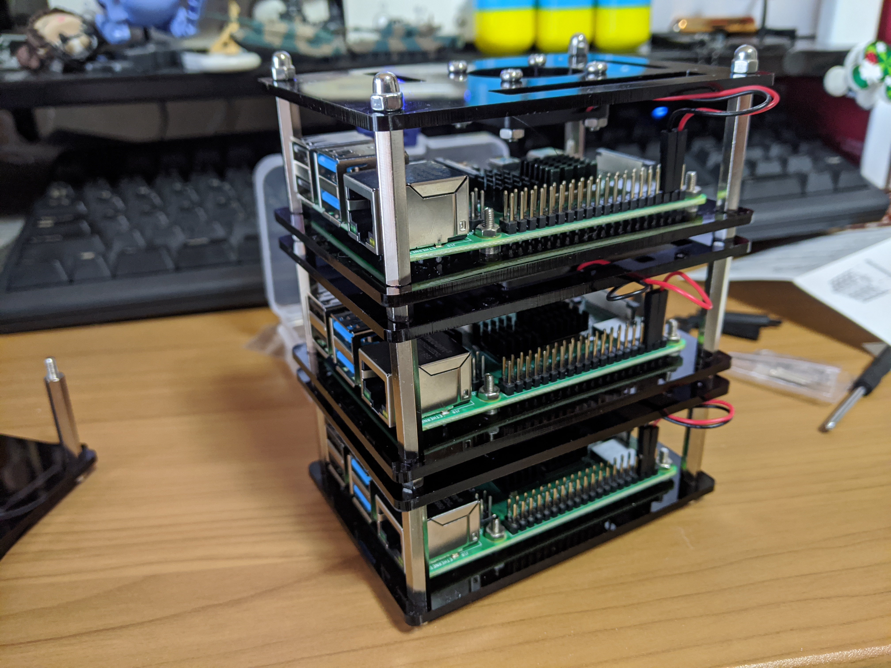

# Raspberry Pi 上に Kubernetes クラスタを作る

自分の所属している会社、[LAPRAS](https://lapras.com)で夏の自由研究リレーを行っているので今回はそれに便乗して最近やってるネタを書いてみます。

多くの人がもうすでにやっているネタではあるのですが、Raspberry Pi 上に Kubernetes クラスタを構築してみました。大抵の人は Raspbian（現 Raspberry Pi OS）を使って構築しているみたいでしたが、自分はあんまりやってる人を見かけなかった Arch Linux での構築にチャレンジしてみました。

## ハードウェアの準備

ハードウェアは以下のものを用意しました。

| 名称                     | 単価 | 個数 |
| :----------------------- | ---: | ---: |
| Raspberry Pi 4 4GB       | 6100 |    3 |
| Anker PowerPort Speed 4  | 2999 |    1 |
| Buffalo LSW6-GT-5EPL/NBK | 1280 |    1 |
| 積層ケース               | 2759 |    1 |
| USB Type-C ケーブル      |  699 |    3 |
| LAN ケーブル             |  781 |    3 |
| Micro SD カード 32GB     | 1080 |    3 |

大体 3 万円越えるぐらいになりました。

## ハードウェアを組み立てる

まずはハードウェアの準備をします。

積層ケースを購入したので一つずつ Raspberry Pi を固定してヒートシンクを接着し、ケースにファンを取り付けていきます。


ネジ止めなど意外と根気がいるのでそれなりに余裕を持って作業すると良いです。



全部設置できると見た目がかっこいい何かができます。正直これだけでも満足度が高いです。


## Raspberry Pi に ArchiLinux をインストールする

Micro SD に ArchiLinux をインストールしていきます。

だいたい[公式のページ](https://archlinuxarm.org/platforms/armv8/broadcom/raspberry-pi-4)にやり方は載っていますし、過去別の[ブログで書いた](https://www.chirashiura.com/entry/2019/12/15/005240)のですが、あらためて簡単に手順を書いていきます。

1. fdisk で SD カードのパーティションを切る
   - boot 用のパーティションと root 用のパーテイションを用意します
2. mkfs でパーティションのフォーマットをする
   - boot 用のパーテイションを VFAT ｍ root 用のパーティションを ext4 にします
3. boot と root 2 つのディレクトリを作成し、それぞれマウントする
4. `wget http://os.archlinuxarm.org/os/ArchLinuxARM-rpi-4-latest.tar.gz` で最新の ArchLinux を取得する
5. `bsdtar -xpf ArchLinuxARM-rpi-4-latest.tar.gz -C root` で root にインストールし最後に `sync` を実行する
6. `mv root/boot/* boot` で boot の中身を boot 用パーティションにコピーする

これで SD カードへのインストールは完了です。Raspberry Pi は 3 台あるので 3 台分繰り返します。

このインストール作業時に予め公開鍵をコピーして配置しておくとあとは作業端末から ssh で接続して作業できるので楽です。

インストールが終わった MicroSD はそれぞれ Raspberry Pi に刺して電源を入れておきます。

## ArchLinux に Kubernetes をインストールする準備をする

OS の準備ができたので Kubernetes をインストールする準備をします。

まず IP を固定したいのですが肝心の RaspberryPi の IP がわからないので ssh で接続できません。

このときは nmap を使用して強引に特定しました。

```cmd
$ sudo nmap -sP 192.168.1.0/24
...
Nmap scan report for 192.168.1.2
Host is up (0.00021s latency).
MAC Address: CC:CC:CC:CC:CC:CC (Raspberry Pi Trading)
Nmap scan report for 192.168.1.3
Host is up (0.00023s latency).
MAC Address: BB:BB:BB:BB:BB:BB (Raspberry Pi Trading)
Nmap scan report for 192.168.1.4
Host is up (0.00019s latency).
MAC Address: AA:AA:AA:AA:AA:AA (Raspberry Pi Trading)
...
```

MAC Address の行に Raspberry Pi Trading と書いてアレば Raspberry Pi なのでそこで IP を特定し ssh 接続し作業を開始します。

まずは IP の固定を行います。 `/etc/systemd/network/eth0.network` を次のように編集し IP を固定します。

```
[Match]
Name=eth0

[Network]
Address=192.168.1.1/24
Gateway=192.168.1.2
DNS=8.8.8.8
```

これを 3 台分繰り返し固定します。

次に ArchLinux のパッケージ管理ツール pacman の設定を行います。次のコマンドを実行し pacman を使えるようにします。

```cmd
$ pacman-key --init
$ pacman-key --populate archlinuxarm
```

これを 3 台分繰り返します。

次に cgroup や docker などは AUR からインストールする必要があるので AUR ヘルパーの yay をインストールします。次のコマンドでインストールします。

```cmd
$ git clone https://aur.archlinux.org/yay.git
$ cd yay
$ makepkg -si
```

これを 3 台分繰り返します。

yay を使用し cgroup と docker をインストールし有効化します。

```
$ yay -Sy cgroup docker
$ sudo systemctl enable docker.service
$ sudo systemctl enable cgconfig.service
```

cgroup は起動オプションが必要になるので `/boot/cmdline.txt` に次の設定を追記します。

```
cgroup_enable=cpuset cgroup_memory=memory　cgroup_memory=1
```

これを 3 台（以下略

次に yay を使用し kubernetes が利用するネットワーク関連のパッケージをインストールします。

```
$ yay -S ethtool ebtables socat conntrack-tools
```

これを 3（以下略

これで Kubernetes をインストールする準備が整いました。Raspberry Pi の台数分作業が繰り返しになるので Ansible などを使って自動化したほうが良さそうです。

## Kubernetes のインストール

いよいよ Kubernetes のインストールです。通常は yay を使ってインストールするのが良いのですが、自分の場合 yay だとうまくいきませんでした。なのでパッケージ管理システムによらないインストール方法でインストールを行います。インストール時の URL で CPU のアーキテクチャの文字列を arm にするのがポイントです。

まずは CNI Plugins をインストールします。

```cmd
$ CNI_VERSION="v0.8.2"
$ sudo mkdir -p /opt/cni/bin
$ curl -L "https://github.com/containernetworking/plugins/releases/download/${CNI_VERSION}/cni-plugins-linux-arm-${CNI_VERSION}.tgz" | sudo tar -C /opt/cni/bin -xz
```

次に kubeadm kubelet kubectl をインストールします。

```cmd
$ DOWNLOAD_DIR=/usr/local/bin
$ sudo mkdir -p $DOWNLOAD_DIR
$ RELEASE="$(curl -sSL https://dl.k8s.io/release/stable.txt)"
$ cd $DOWNLOAD_DIR
$ sudo curl -L --remote-name-all https://storage.googleapis.com/kubernetes-release/release/${RELEASE}/bin/linux/arm/{kubeadm,kubelet,kubectl}
$ sudo chmod +x {kubeadm,kubelet,kubectl}

$ RELEASE_VERSION="v0.2.7"
$ curl -sSL "https://raw.githubusercontent.com/kubernetes/release/${RELEASE_VERSION}/cmd/kubepkg/templates/latest/deb/kubelet/lib/systemd/system/kubelet.service" | sed "s:/usr/bin:${DOWNLOAD_DIR}:g" | sudo tee /etc/systemd/system/kubelet.service
$ sudo mkdir -p /etc/systemd/system/kubelet.service.d
$ curl -sSL "https://raw.githubusercontent.com/kubernetes/release/${RELEASE_VERSION}/cmd/kubepkg/templates/latest/deb/kubeadm/10-kubeadm.conf" | sed "s:/usr/bin:${DOWNLOAD_DIR}:g" | sudo tee /etc/systemd/system/kubelet.service.d/10-kubeadm.conf
```

これで Kubernetes 関連ツールのインストールは完了です。

## Kubeadm でクラスタを作る

ここまできたらコマンドは問題なく実行できます。kubeadm を使ってクラスタを構築していきます。

次のコマンドで master node をセットアップします。

```cmd
$ sudo kubeadm init --pod-network-cidr=10.244.0.0/16

...

Your Kubernetes master has initialized successfully!

To start using your cluster, you need to run the following as a regular user:

  mkdir -p $HOME/.kube
  sudo cp -i /etc/kubernetes/admin.conf $HOME/.kube/config
  sudo chown $(id -u):$(id -g) $HOME/.kube/config

You should now deploy a pod network to the cluster.
Run "kubectl apply -f [podnetwork].yaml" with one of the options listed at:
  https://kubernetes.io/docs/concepts/cluster-administration/addons/

You can now join any number of machines by running the following on each node
as root:

  kubeadm join 192.168.1.2:6443 --token xx --discovery-token-ca-cert-hash sha256:xx

$ mkdir -p $HOME/.kube
$ sudo cp -i /etc/kubernetes/admin.conf $HOME/.kube/config
$ sudo chown $(id -u):$(id -g) $HOME/.kube/config
```

master nodeのセットアップがこれで完了します。

次にワーカーnodeを次のコマンドで登録していきます。

```cmd
$ kubeadm join 192.168.1.2:6443 --token xx --discovery-token-ca-cert-hash sha256:xx
```

今回はワーカーノードが２つなので２回繰り返します。

この状態でmasterノードでkubectlを実行してみます。

```cmd
$ kubectl get nodes
NAME            STATUS      ROLES    AGE     VERSION
k8s-master-01   NotReady    master   13m     v1.18.5
k8s-node-01     NotReady    <none>   2m15s   v1.18.5
k8s-node-02     NotReady    <none>   100s    v1.18.5
```

いったんすべてのノードを確認することができます。

ただこの状態だとまだNotReadyで正しく構築できていません。kube-dnsがまだ動いていないのが原因です。kube-dnsを正しく動かすためにネットワークの設定を行います。

## flannel のインストール

Kubernetesのネットワーク周りで今回はflannelを使います。flannelは普通にkubectlを使用してデプロイを行います。

```
$ kubectl apply -f https://raw.githubusercontent.com/coreos/flannel/master/Documentation/kube-flannel.yml
```

これで問題なければ、kube-dnsが正しく動き各nodeがReadyになります

```cmd
$ kubectl get nodes
NAME            STATUS   ROLES    AGE     VERSION
k8s-master-01   Ready    master   13m     v1.18.5
k8s-node-01     Ready    <none>   2m15s   v1.18.5
k8s-node-02     Ready    <none>   100s    v1.18.5
```

これでKubernetesの環境が整いました。あとはアプリケーション作ってデプロイしたりするだけです。

## まとめ

ざっとRaspberry PiでKubernetesクラスタを作成する手順を書いていきました。ちょっといろいろ端折ったりまとめ方が拙いのでそのうちリライトする予定です。

とりあえず最後に言いたいこととしては、Raspberry PiでKubernetesクラスタを作るのは楽しいので暇とお金がある方はぜひ試してほしいです。

## 参考資料

- [Raspberry PiでおうちKubernetes構築【論理編】](https://qiita.com/go_vargo/items/29f6d832ea0a289b4778)
- [kubeadm で kubernetes v1.8 + Flannel をインストール](https://qiita.com/hichihara/items/79ef6613026f8c13eb99)
- [Arch Linux に kubeadm で開発用 Kubernetes クラスタを構築してみる](https://qiita.com/Aruneko/items/89b97aae755cc098f4c0)
